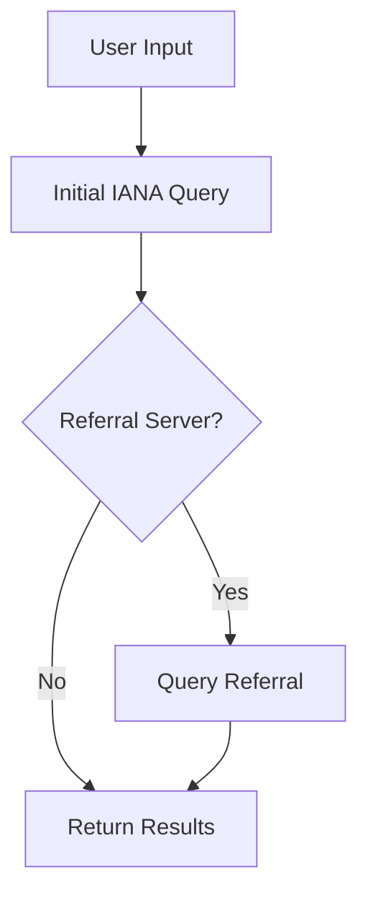

# System Patterns

## Architecture Overview
The system follows a simple, linear flow with promise-based asynchronous operations:

## Core Components

### QueryWhoisServer Function
- Handles TCP connections to WHOIS servers
- Manages data buffering
- Implements proper WHOIS protocol (CRLF)
- Returns promises for async operation

### LookupWhois Function
- Coordinates the query process
- Handles referral server logic
- Manages the query chain

## Design Patterns
1. Promise Pattern
   - Async operations for network requests
   - Clean error handling
   - Sequential operation flow

2. Buffer Pattern
   - Accumulates data chunks
   - Handles streaming response

3. Event-Driven Pattern
   - TCP connection events
   - Error handling events
   - Data reception events

## Component Relationships
- Main script → LookupWhois → QueryWhoisServer
- Each component has single responsibility
- Clear separation of concerns